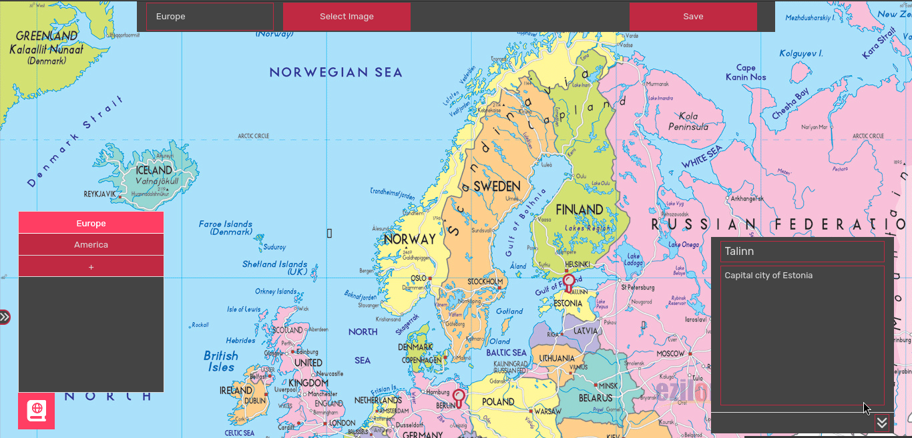

# Prerequisites
-NodeJS (https://nodejs.org/en/download/package-manager) 

-Git (optional)

# Installation
 1. run `git clone https://github.com/acornfish/WorldLoom.git`
 2. Run the appropriate script file on the main folder (`start.sh` on linux and `start.ps1` on windows)
 3. Follow the instructions on the script output
 4. if you want to update to current version just do `git pull`

# Installation - Docker
 1. run `git clone https://github.com/acornfish/WorldLoom.git`
 2. Change to the repository directory (`cd WorldLoom`)
 3. install https://docs.docker.com/engine/install/
 4. run `docker compose up`

The data is stored in `/usr/src/app/files` for persistence

# Features

## Articles
You can create articles which tell about your characters, areas, religions, species and so much more. Provided rich text editor allows adding tables, images, titles and links which can be used to reference other articles. 

## Maps
Map feature allows you to import images and mark areas using pins. 

## Manuscripts
This feature assists you with the process of writing the story. You can use all features of articles and a few special ones such as searching and word checking.

## Timelines
You can chronologicaly list events using the timelines feature.

# Exporting
You can export your project in HTML format to upload as a wiki website

# Credits

## Wordlists
English: [Edgar Dale](https://en.wikipedia.org/wiki/Edgar_Dale) / [Jeanne Chall](https://en.wikipedia.org/wiki/Jeanne_Chall)

English2: [Oxford Learner's Dictionaries](https://www.oxfordlearnersdictionaries.com/)

Russian: [Neri](https://www.blogger.com/profile/00782205209018274322)

Turkish: [3000mostcommonwords.com](https://3000mostcommonwords.com/)

# Troubleshooting

## Npm is not found

If you have installed nodejs via ...

Prebuilt installer, Package manager: Reinstall the application and if the issue persists try another method 

Prebuilt binary: Try adding the nodejs installation to the PATH envoriment variable 

Source code: Try another method

Please open a issue if you come across another problem. Thanks in advance.
